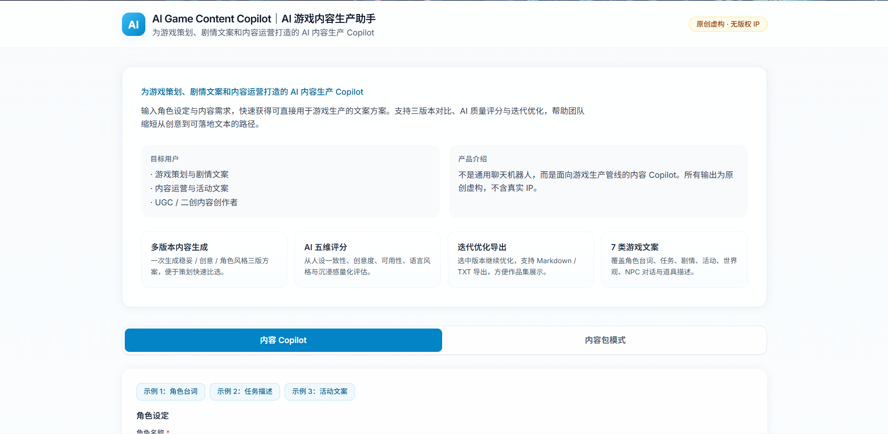
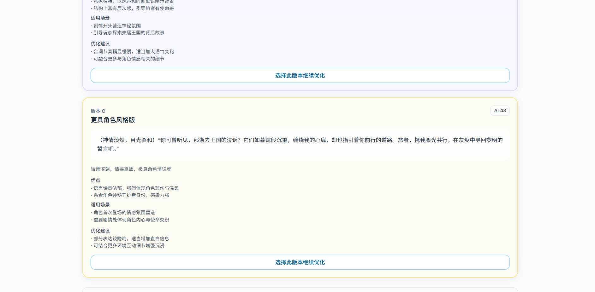
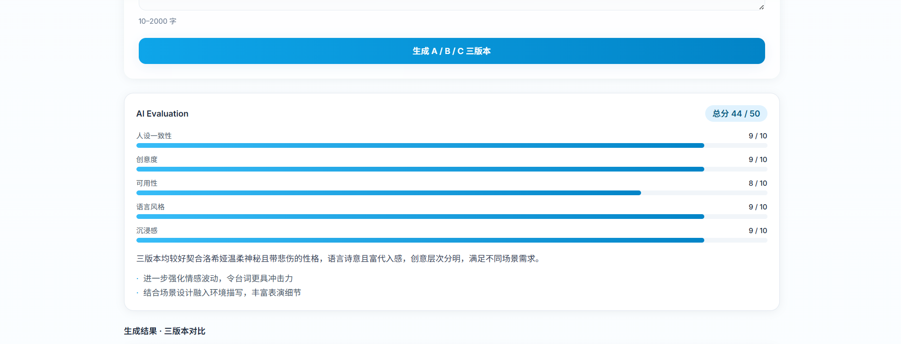
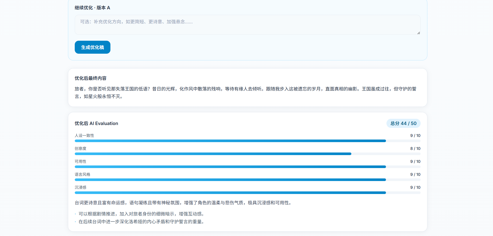

# AI Game Content Copilot｜AI 游戏内容生产助手

<div align="center">

**上传或输入游戏创意 · 生成多版本游戏文本 · AI 评分 · 优化 · 导出策划文档**

面向游戏策划、剧情文案与内容运营的 **结构化游戏文本生产 Copilot**（非聊天机器人）

<br/>

[](https://www.python.org/)
[](https://react.dev/)
[](https://fastapi.tiangolo.com/)
[](https://vitejs.dev/)
[](LICENSE)
[](docs/screenshots/evaluation.png)
[](https://platform.openai.com/docs/api-reference)

</div>

---

## 目录

- [项目预览](#项目预览)
- [1. 项目介绍](#1-项目介绍)
- [2. 项目背景](#2-项目背景)
- [3. 目标用户](#3-目标用户)
- [4. 核心功能](#4-核心功能)
- [5. 示例测试输入](#5-示例测试输入)
- [6. AI 能力设计](#6-ai-能力设计)
- [7. 技术栈](#7-技术栈)
- [8. 产品流程](#8-产品流程)
- [9. 项目结构](#9-项目结构)
- [10. 安装教程（本地运行）](#10-安装教程本地运行)
- [11. 环境变量说明](#11-环境变量说明)
- [12. 常见问题排查](#12-常见问题排查)
- [13. API 概览](#13-api-概览)
- [14. 当前限制](#14-当前限制)
- [15. 安全与隐私说明](#15-安全与隐私说明)
- [16. Roadmap](#16-roadmap)
- [17. License](#17-license)

---

## 项目预览

本项目将游戏内容生产从「单次对话」升级为可演示的 **AI 产品工作流**：

| 环节 | 说明 |
|------|------|
| **角色设定** | 名称、性格、阵营、世界观、说话风格、动机等人设约束 |
| **内容类型** | 7 类游戏文本场景（台词、任务、剧情、活动等） |
| **三版本生成** | A 稳妥版 / B 创意版 / C 角色风格版，卡片并排比选 |
| **AI Evaluation** | 五维量化评分（人设、创意、可用性、语言、沉浸）+ 总评与建议 |
| **继续优化** | 选中版本后补充反馈，生成优化稿并更新评分 |
| **导出** | Markdown / TXT 策划文档 |
| **高级模式** | 输入游戏创意，一次生成 8 大模块结构化内容包 |

> **体验方式**：按 [§10 安装教程（本地运行）](#10-安装教程本地运行) 在本地启动前后端。  
> 所有生成内容为 **AI 原创虚构**，不使用真实游戏 IP、角色名或版权素材。

### 界面截图


| 首页 · 产品定位 | 三版本生成（一） | 三版本生成（二） |
|:---:|:---:|:---:|
|  |  |  |

| AI 五维评分 | 继续优化 | 高级 · 8 模块内容包 |
|:---:|:---:|:---:|
|  |  |  |


---

## 1. 项目介绍

**AI Game Content Copilot** 是一款面向游戏内容生产流程的 AI Copilot 原型，帮助策划与文案在 **角色人设与世界观约束** 下，快速产出可比较、可评分、可迭代、可导出的游戏文本。

与通用聊天机器人的核心差异：

| 维度 | 通用聊天 | 本项目 |
|------|----------|--------|
| 交互形态 | 开放式多轮对话 | **结构化表单 + 固定工作流** |
| 输出形态 | 自由文本 | **JSON Schema + 三版本卡片 + 评分对象** |
| 产品目标 | 回答问题 | **支撑策划比选、审稿与文档化** |
| 能力边界 | 泛化问答 | **七类游戏文本 + 可选 8 模块内容包** |

---

## 2. 项目背景

手游与二次元向内容生产中，策划与文案常遇到以下痛点：

| 问题 | 影响 |
|------|------|
| **灵感启动难** | 空文档起步成本高，人设与世界观难以一次写全 |
| **初稿产出慢** | 单点台词、任务、活动文案反复推敲占用大量时间 |
| **多版本比选成本高** | 同一需求需手写多个语气版本，横向对比效率低 |
| **角色风格难保持一致** | 长链路创作中容易出现人设漂移、口吻不统一 |
| **AI 生成缺少评测机制** | 纯生成难以支撑「选哪一版、为何选」的产品决策 |
| **结果难进入文档流程** | 生成物与策划文档、评审材料之间缺少结构化衔接 |

本项目以 **「输入约束 → 多版本方案 → AI Evaluation → 优化 → 导出」** 串联上述环节，形成可演示、可讲解的 AIGC 游戏内容生产原型。

---

## 3. 目标用户

| 用户类型 | 典型使用场景 | 本项目提供的价值 |
|----------|--------------|------------------|
| **游戏策划** | 角色台词、任务描述、剧情片段起草 | 三版本比选 + 五维评分，缩短从需求到初稿的路径 |
| **剧情文案** | 在人设约束下扩写、调整语气与节奏 | 角色设定表单 + 优化链路，降低风格漂移 |
| **内容运营** | 版本活动页、限时宣传等手游向文案 | 活动文案类型 + 结构化导出 |
| **二创作者 / UGC** | 快速验证角色与世界观设定 | 预设示例 + 多类型内容生成 |
| **AI 产品实习作品集** | 展示 AIGC 工作流与 Evaluation 设计 | 完整前后端 Demo + 可复现本地运行 |

---

## 4. 核心功能

| 功能模块 | 能力说明 | 产品价值 |
|----------|----------|----------|
| **角色设定输入** | 名称、性格、阵营、世界观、说话风格、动机 | 将「人设约束」前置为结构化输入，而非散落在对话里 |
| **内容类型选择** | 7 类：角色台词、任务描述、剧情片段、活动文案、世界观设定、NPC 对话、道具描述 | 按场景切换 Prompt，输出更贴近真实岗位分工 |
| **三版本生成** | A 稳妥正式 · B 更有创意 · C 更具角色风格；附优点、适用场景、版本分 | 对应策划「比选」习惯，而非单次碰运气 |
| **AI 五维评分** | 人设一致性、创意度、可用性、语言风格、沉浸感（0–10）+ 总分 + 评语 | 将主观审稿部分结构化，便于演示与讨论 |
| **继续优化** | 选中版本 + 补充反馈 → 优化稿 + 更新评分 | 贴近「策划返工」真实流程 |
| **Markdown / TXT 导出** | 含项目信息、角色设定、需求、正文与评分 | 生成结果可直接进入文档协作 |
| **高级内容包模式** | 输入游戏创意 → 8 大模块（活动、世界观、NPC、对话树、任务流、玩家反馈、一致性、优化建议） | 展示从单点文案到系统化内容包的能力广度 |
| **一键示例** | 3 组预设（角色台词 / 主线任务 / 活动文案） | 1 分钟内完成作品集演示 |

---

## 5. 示例测试输入

复制以下字段到 Copilot 表单，即可快速验证主流程（角色台词场景）：

```text
角色名称：洛希娅
性格：温柔、神秘、带一点悲伤
世界观：幻想大陆中失落王国「银庭」的最后守护者
内容类型：角色台词
需求：请生成她首次登场时对主角说的话，要求温柔、神秘、有宿命感，适合二次元幻想手游主线剧情开场。
```

**表单填写对照**（其余字段可按演示需要补充）：

| 字段 | 建议填写 |
|------|----------|
| 阵营 | 银庭遗民 / 守护者 |
| 说话风格 | 轻柔、留白多、略带诗意 |
| 目标/动机 | 引导主角正视王国覆灭真相，同时隐藏自身代价 |

---

## 6. AI 能力设计

| 能力名称 | 实现方式 | 产品价值 |
|----------|----------|----------|
| **Prompt Engineering** | `src/prompts/` 按内容类型拆分模板；`router.py` 统一路由；注入角色、世界观、JSON 约束与手游文案风格 | Prompt 可维护、可迭代，便于面试讲解「如何控风格」 |
| **多版本生成** | `generation_service` 单次调用输出 A/B/C + 各版说明与版本分 | 支撑策划横向比选，体现「生成即方案」而非「生成即终稿」 |
| **AI Evaluation** | `evaluation_prompt.py` + `evaluation_service`；五维打分 + 总评 + 建议 | 补齐「生成后怎么选」的决策层，体现 AI 产品质量意识 |
| **内容优化** | `optimize_prompt.py`；在保持人设前提下迭代选中版本 | 贴近返工流程，展示闭环而非一次性生成 |
| **结构化输出** | Pydantic Schema（`src/schemas/copilot.py`）约束请求/响应；前端 TypeScript 类型对齐 | 降低 JSON 解析失败，结果可直接渲染为卡片 |
| **游戏文本工作流** | 前端 `CopilotWorkspace` 状态机 + 后端 API 编排 + `export_service` | 完整产品 Demo，证明「流程设计」而非「套壳聊天」 |

---

## 7. 技术栈

| 层级 | 技术选型 | 用途 |
|------|----------|------|
| **前端** | React 18、Vite、Tailwind CSS | 浅色产品 Demo UI、卡片化结果展示 |
| **后端** | FastAPI、Python 3.11+ | REST API、Schema 校验、服务编排 |
| **模型调用** | OpenAI-compatible API（`llm_service`） | 对接 OpenAI 或国内兼容中转 |
| **数据结构** | Pydantic Schema | 请求/响应契约、Evaluation 与版本对象 |
| **配置** | python-dotenv（`src/config/settings.py`） | 根目录 `.env` 读取 Key，禁止硬编码 |
| **导出** | Markdown / TXT（Copilot）；JSON / PRD Markdown（Legacy） | 策划文档与内容包交付 |
| **工程结构** | 模块化 `src/`（api / services / prompts / schemas） | 便于扩展新内容类型与评测维度 |

---

## 8. 产品流程

```text
角色设定 + 内容类型 + 用户需求
        ↓
生成 A / B / C 三个版本（附版本说明与版本分）
        ↓
AI Evaluation 五维评分 + 总评与优化建议
        ↓
选择版本 →（可选）补充优化意见 → 优化稿 + 更新评分
        ↓
导出 Markdown / TXT
```

**高级模式（独立 Tab）**：

```text
输入游戏创意
        ↓
一次生成 8 大模块内容包（JSON 结构化）
        ↓
导出 JSON / PRD 风格 Markdown
```

---

## 9. 项目结构

以下为仓库主要目录（不含 `node_modules`、`__pycache__`、虚拟环境等）：

```text
AI Game Content Copilot/
├── app.py                      # FastAPI 入口（uvicorn app:app）
├── requirements.txt
├── .env.example                # 后端环境变量模板
├── .gitignore
├── README.md
├── src/                        # 后端主代码（请在此开发）
│   ├── api/
│   │   ├── main.py             # 应用装配与 CORS
│   │   └── routes/
│   │       ├── health.py       # GET /api/health
│   │       ├── copilot.py      # Copilot 主流程 API
│   │       └── legacy.py       # 8 模块内容包 API
│   ├── config/settings.py      # .env 加载
│   ├── prompts/                # 分场景 Prompt；legacy/ 为内容包模板
│   ├── schemas/                  # copilot / legacy Pydantic 模型
│   ├── services/                 # 生成、评分、优化、导出；legacy/ 为内容包
│   └── utils/
├── frontend/
│   ├── .env.example
│   ├── package.json
│   ├── vite.config.ts
│   ├── public/
│   └── src/
│       ├── api/                  # client.ts、baseUrl.ts
│       ├── components/
│       │   ├── copilot/          # Copilot 工作区
│       │   ├── legacy/           # 8 模块内容包 UI
│       │   ├── layout/           # Header、Footer、HomeHero
│       │   ├── sections/         # 内容包结果分区卡片
│       │   └── ...
│       ├── types/
│       └── utils/export/
├── docs/screenshots/             # README 截图
└── backend/                      # 遗留目录（与 src 重复，仅作兼容；新代码勿写此处）
    └── app/
        └── main.py               # 旧路径 shim → src.api.main:app
```

---

## 10. 安装教程（本地运行）

按以下步骤可在本机完整跑通前后端。变量说明见 [§11 环境变量说明](#11-环境变量说明)；报错见 [§12 常见问题排查](#12-常见问题排查)。

### 环境要求

| 依赖 | 版本要求 | 用途 |
|------|----------|------|
| **Python** | 3.11+ | FastAPI 后端 |
| **Node.js** | 18+ | Vite 前端开发服务器 |
| **npm** | 随 Node 安装 | 安装前端依赖 |
| **Git** | 任意较新版本 | 克隆仓库 |
| **OpenAI 兼容 API** | 需自备 Key | 文本生成与评分 |

### 10.1 克隆仓库并进入目录

```bash
git clone https://github.com/cccc-clt/AI-Game-Content-Copilot.git
cd AI-Game-Content-Copilot
```


### 10.2 配置后端环境变量

在 **项目根目录**（与 `app.py` 同级）创建 `.env`：

```bash
# Windows
copy .env.example .env

# macOS / Linux
cp .env.example .env
```

编辑 `.env`，至少填写有效的 `OPENAI_API_KEY` 与 `OPENAI_MODEL`（详见 [§11](#11-环境变量说明)）。**勿将 `.env` 提交到 Git。**

### 10.3 创建虚拟环境并安装后端依赖

**必须在项目根目录执行**（保证 `import src` 与 `app:app` 入口正确）：

```bash
python -m venv .venv

# Windows
.venv\Scripts\activate

# macOS / Linux
source .venv/bin/activate

pip install -r requirements.txt
```

### 10.4 启动 FastAPI 后端

虚拟环境激活后，仍在项目根目录：

```bash
uvicorn app:app --reload --host 127.0.0.1 --port 8000
```

也可使用：`python app.py`（默认监听 `127.0.0.1:8000`）

| 检查项 | 地址 |
|--------|------|
| 健康检查 | http://127.0.0.1:8000/api/health |
| 期望结果 | `"ready": true`（表示 Key 与 Model 已正确配置） |

> **注意**：勿在 `backend/` 目录启动；当前入口为根目录 `app.py` → `src.api.main:app`。

### 10.5 安装前端依赖并启动开发服务器

**新开一个终端**，进入 `frontend/`：

```bash
cd frontend

# Windows
copy .env.example .env

# macOS / Linux
cp .env.example .env

npm install
npm run dev
```

确认 `frontend/.env` 中 API 地址与后端一致：

```env
VITE_API_BASE_URL=http://localhost:8000
```

| 访问 | 地址 |
|------|------|
| 前端界面 | http://localhost:5173 |
| 后端 API | http://localhost:8000 |

### 10.6 验证安装成功

1. 浏览器打开 http://127.0.0.1:8000/api/health ，确认 `ready` 为 `true`。  
2. 打开 http://localhost:5173 ，点击「示例 1：角色台词」→「生成 A/B/C」，能出现三版本卡片即表示链路正常。

---

## 11. 环境变量说明

### 根目录 `.env`（后端）

| 变量 | 说明 |
|------|------|
| `OPENAI_API_KEY` | OpenAI 兼容 API 密钥；勿使用占位值 `your_api_key_here` |
| `OPENAI_BASE_URL` | API 根地址，默认 `https://api.openai.com/v1` |
| `OPENAI_MODEL` | 模型名称；须替换 `your-model-name` |
| `CORS_ORIGINS` | 可选；英文逗号分隔的前端源，默认已含 `http://localhost:5173` |

`CORS_ORIGINS` 本地示例：

```env
CORS_ORIGINS=http://localhost:5173,http://127.0.0.1:5173
```

### `frontend/.env`（前端）

| 变量 | 说明 |
|------|------|
| `VITE_API_BASE_URL` | 本地后端根地址，**不要**以 `/` 结尾 |

```env
VITE_API_BASE_URL=http://localhost:8000
```

**安全提醒**：

- **不要**在前端配置 `OPENAI_API_KEY`；所有模型调用经后端代理。  
- `.env` 与用户输入均 **不要提交到 GitHub**。仓库仅保留 `.env.example` 模板。

---

## 12. 常见问题排查

| 现象 | 可能原因 | 处理建议 |
|------|----------|----------|
| **401 Unauthorized** | API Key 未配置、拼写错误，或仍为占位值 | 检查根目录 `.env` 中的 `OPENAI_API_KEY`；访问 `/api/health` 查看 `ready` |
| **429 Too Many Requests** | 模型接口限流、配额用尽或账户余额不足 | 降低调用频率；更换模型；在服务商控制台查看用量与账单 |
| **浏览器 CORS 报错** | 前端源未加入后端 `CORS_ORIGINS` | 在 `.env` 中将 `http://localhost:5173` 写入 `CORS_ORIGINS` 后重启后端 |
| **端口被占用** | 8000 / 5173 已被其他进程使用 | 关闭占用进程，或后端改用 `--port 8002` 并同步 `frontend/.env` 中的 `VITE_API_BASE_URL` |
| **`ModuleNotFoundError: No module named 'src'`** | 未在项目根目录启动，或虚拟环境未激活 | 确认当前目录含 `app.py`；执行 `pip install -r requirements.txt`；激活 `.venv` 后再启动 |
| **`ready: false`（health）** | `OPENAI_MODEL` 仍为占位值或 Key 无效 | 对照 `.env.example` 填写真实 `OPENAI_MODEL` 与有效 Key |
| **前端请求失败 / 连不上后端** | `VITE_API_BASE_URL` 与后端端口不一致 | 确认 `frontend/.env` 为 `http://localhost:8000` 且后端已启动 |
| **生成超时或长时间无响应** | 模型响应较慢 | 等待后重试；本地可先调小需求文本验证链路 |

仍无法解决时，可附带 `/api/health` 返回、浏览器 Network 面板截图与后端终端日志进行排查。

---

## 13. API 概览

### Copilot（主流程）

| 方法 | 路径 | 说明 |
|------|------|------|
| `GET` | `/api/health` | 服务状态与 Key/Model 配置检测 |
| `POST` | `/api/copilot/generate` | 三版本生成 + Evaluation |
| `POST` | `/api/copilot/optimize` | 选中版本优化 |
| `POST` | `/api/copilot/evaluate` | 独立五维评分 |
| `POST` | `/api/copilot/export/markdown` | 导出 Markdown |
| `POST` | `/api/copilot/export/txt` | 导出 TXT |

### Legacy（高级 · 8 模块内容包）

| 方法 | 路径 | 说明 |
|------|------|------|
| `POST` | `/api/generate` | 一次生成 8 大模块游戏内容包 |
| `POST` | `/api/export/markdown` | PRD 风格 Markdown 导出 |

---

## 14. 当前限制

| 限制项 | 说明 |
|--------|------|
| **原型阶段** | 侧重产品流程与能力演示，非生产级 SaaS |
| **生成质量** | 依赖所选模型能力与 Prompt 设计，需人工终审 |
| **数据闭环** | 暂无真实用户行为数据、A/B 实验与效果看板 |
| **高级内容包** | 8 模块模式可继续深化模块间一致性与联动校验 |
| **运行方式** | 需在本地配置 API Key 后启动，暂无托管在线 Demo |
| **流式体验** | 当前为一次性返回，尚未支持 SSE 流式输出 |

---

## 15. 安全与隐私说明

请勿将以下内容提交到公开仓库或截图外泄：

| 类别 | 示例 |
|------|------|
| 密钥与配置 | `.env`、`OPENAI_API_KEY` |
| 依赖与构建产物 | `node_modules/`、`frontend/dist/`、`__pycache__/` |
| 本地环境 | `.venv/`、`backend/.venv/` |
| 日志与临时文件 | 本地运行日志、调试导出文件 |
| 用户数据 | 表单中填写的创意、角色设定等输入内容 |

`.gitignore` 已覆盖常见敏感路径；分享作品集时请使用打码截图或示例数据。

---


## 16. Roadmap

- [ ] **SSE 流式生成**：降低长文本等待焦虑，展示生成进度
- [ ] **历史项目保存**：SQLite 存储多轮会话与导出记录
- [ ] **多模型切换**：按场景选择不同模型（创意 / 稳定）
- [ ] **评分雷达图**：五维 Evaluation 可视化
- [ ] **角色库**：复用常用人设与世界观片段
- [ ] **世界观知识库**：RAG 约束长线设定一致性
- [ ] **团队协作**：共享项目、评论与版本锁定
- [ ] **内容审核**：敏感词与合规策略接入
- [ ] **A/B 测试**：对比不同 Prompt 策略的效果
- [ ] **数据看板**：生成次数、评分分布、导出使用率

---

## 17. License

本项目采用 [MIT License](LICENSE) 开源。如仓库尚未包含 `LICENSE` 文件，可按 MIT 惯例补充。

---

